## Predicting Market Reactions to News:

An LLM-Based Approach Using Spanish Business Articles

#### **Abstract**

Markets do not always efficiently incorporate news, particularly when information is complex or ambiguous. Traditional text analysis methods fail to capture the economic structure of information and its firm-specific implications. We propose a novel methodology that guides LLMs to systematically identify and classify firm-specific economic shocks in news articles according to their type, magnitude, and direction. This economically-informed classification allows for a more nuanced understanding of how markets process complex information. Using a simple trading strategy, we demonstrate that our LLM-based classification significantly outperforms a benchmark based on clustering vector embeddings, generating consistent profits out-of-sample while maintaining transparent and durable trading signals. The results suggest that LLMs, when properly guided by economic frameworks, can effectively identify persistent patterns in how markets react to different types of firm-specific news. Our findings contribute to understanding market efficiency and information processing, while offering a promising new tool for analyzing financial narratives.

*Keywords:* Large Language Models, Business News, Stock Market Reaction, Market Efficiency

*JEL:* G12, G14, C45, C58, C63, D83

## **1. Introduction**

News move asset prices, but markets underreact to complex information, challenging the EMH [\[1\]](#page-8-0). We show that adding explicit economic structure to news processing improves firm–level return timing.

We identify three shortcomings in the literature: (i) methods focus on linguistic regularities rather than economic mechanisms—sentiment depends on domain dictionaries and weights [\[2,](#page-8-1) [3\]](#page-8-2), topic models miss evolving narratives, and embeddings predict well but are economically agnostic [\[4,](#page-8-3) [5,](#page-8-4) [6\]](#page-8-5); (ii) firm–specific effects are masked by index–level analysis; and (iii) headline–only inputs lose critical context [\[7,](#page-8-6) [8\]](#page-8-7).

We propose an economically structured read of full articles with a large language model (LLM). The LLM extracts firm–specific shocks and classifies them by type (demand, supply, technology, policy, financial), magnitude (minor/major), and direction (positive/negative), yielding interpretable labels aligned with economic reasoning.

Data are Spanish business news from Dow Jones Newswires (June 2020–September 2021). As a strong benchmark, we embed articles with a sentence transformer and cluster via KMeans; our LLM approach clusters by shock labels. We evaluate timing by forming market–beta–neutral returns for firm–article pairs, computing cluster–average Sharpe ratios, and implementing a long–short strategy that goes long the best clusters and short the worst.

Main result: embedding clusters are economically interpretable (firm/industry structure) but deliver weakly persistent signals out of sample, whereas LLM shock clusters yield more persistent signals and higher out–of–sample performance. Adding economic structure to text processing improves the translation of news into tradable information.

This is a compact methodological contribution rather than a production strategy. The schema is portable and can scale to larger corpora and richer trading designs. Section 2 describes data; Section 3 the framework; Section 4 clustering; Section 5 the strategy; Section 6 robustness; Section 7 concludes.

## **2. Data**

We employ Spanish business news articles from Dow Jones Newswires covering June 24, 2020, to September 30, 2021. This period encompasses the Covid-19 era, allowing us to test our methodology during significant market volatility when traditional textual algorithms often struggle to maintain predictive power.

<span id="page-1-0"></span>The dataset includes articles mentioning IBEX-35 firms, Spain's largest companies by market capitalization. Dow Jones systematically includes stock tickers in parentheses for directly affected firms, facilitating named entity recognition (NER). We employ a regex pattern recognition algorithm to identify Spanish firms using the format "(<WORD>.MC)". Consider the following example:

Example 1: An article about ACS and Acciona (translated into English)

#### ACS and Acciona Secure Contracts for New Australian Airport

A consortium of Actividades de ConstrucciÃşn y Servicios SA (ACS.MC) and Acciona SA (ANA.MC) has won a contract to build the operations area of the Western Sydney International Airport (Nancy-Bird Walton) and carry out paving works, amounting to AUD265 million (EUR164 million) for the Australian subsidiary CIMIC Group Ltd (CIM.AU). CIMIC will carry out the work through its subsidiary CPB Contractors, as stated in a press release. This is the third project awarded by Western Sydney Airport to the joint venture after being selected to carry out earthworks. Construction will take two years, and the Western Sydney airport is expected to open in 2026.

Our NER algorithm applied to Example 1 successfully identifies Spanish firms ACS.MC and ANA.MC while disregarding the Australian CIM.AU. We validate extracted entities using an LLM that parses articles according to a predefined schema to identify affected Spanish firms, which are then filtered against IBEX-35 members.

We partition the dataset into Train, Validation, and Test splits, with summary statistics provided in Table 1.

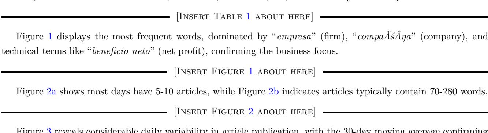

Figure 3 reveals considerable daily variability in article publication, with the 30-day moving average confirming an average of 5-10 articles per day.

- [Insert Figure 3 about here] -

## 3. Mathematical Treatment of News Articles

Our dataset  $\mathcal{D}$  consists of N=2,613 Spanish business news articles from DowJones (2020/06/24 to 2021/09/30), filtered to reference IBEX-35 firms  $\mathcal{F}_{\text{IBEX35}}$ . Each article  $i \in \mathcal{D}$  pertains to a subset of firms  $\mathcal{F}^i \subseteq \mathcal{F}_{\text{IBEX35}}$  with publication datetime  $\langle d_0^i, t_0^i \rangle$ .

Effective treatment day

Since publication datetime may not coincide with trading hours, we define an effective treatment date  $\tilde{d}_0^i$  that maps news publication to the nearest trading date where stock prices can reflect the impact. Let  $\mathfrak{d}$  denote all dates and  $\tilde{\mathfrak{d}} \subset \mathfrak{d}$  denote Spanish trading days. We define  $\Lambda : \mathfrak{d} \to \tilde{\mathfrak{d}}$  as  $\Lambda(d) := \min\{\tilde{d} \in \tilde{\mathfrak{d}} \mid \tilde{d} > d\}$ . The effective treatment date is:

$$\tilde{d}_0^i := \begin{cases} d_0^i & \text{if} \quad d_0^i \in \tilde{\mathfrak{d}} \ \land \ t_0^i < 17:30 \\ \Lambda(d_0^i) & \text{if} \quad d_0^i \notin \tilde{\mathfrak{d}} \ \lor \ t_0^i \ge 17:30 \end{cases}.$$

Figure 4 illustrates these two cases.

[Insert Figure 4 about here]

*Data Splitting*

The dataset is partitioned into three sequential subsets: D := D*tr* ∪ D*val* ∪ D*test*. Training and validation sets comprise 80% of the data for strategy construction and fine-tuning, while the remaining 20% is reserved for out-of-sample testing.

## **4. Clustering News Articles**

In this section we present our clustering methodology based on news-implied firm-specific shock classifications and we compare it against a benchmark based on clustering the vector embedding representations of the articles. For ease of exposition, we will first present the benchmark model.

*4.1. Benchmark: KMeans clustering of vector embeddings*

#### *4.1.1. Why this benchmark?*

We select KMeans clustering of vector embeddings as our benchmark over sentiment analysis and topic modeling. Sentiment analysis lacks granularity (only positive/negative/neutral) and focuses on emotional tone rather than economic impact. Topic modeling relies on bag-of-words representations that fail to capture semantic relationships essential for identifying economic shocks. Vector embeddings from transformer models offer enhanced semantic representation and directly relate to LLM processing, as embeddings constitute the foundational layer of LLMs. This ensures a relevant comparison between basic semantic representations and our specialized LLM classification methodology.

#### *4.1.2. Vector embeddings and clustering*

We use a Multilingual Sentence Transformer to convert each article *i* ∈ D into a 512-dimensional vector embedding **e** *<sup>i</sup>* ∈ R <sup>512</sup> that captures semantic content and contextual nuances. These embeddings enable semantic similarity detection, topic clustering, and implicit sentiment analysis through proximity in the embedding space.

We apply KMeans clustering to group similar articles by minimizing within-cluster sum of squares. The optimal number of clusters *k* <sup>∗</sup> maximizes the average silhouette score:

$$k^* := \arg \max_{k \in \mathbf{k}} \frac{1}{|\mathcal{D}^{tr}|} \sum_{i \in \mathcal{D}^{tr}} s_k(\mathbf{e}^i)$$

Figure [5](#page-18-0) shows that *k* <sup>∗</sup> = 26 maximizes the silhouette score in our training data.

[Insert Figure [5](#page-18-0) about here]

Using *k* <sup>∗</sup> = 26, we fit KMeans on training embeddings to obtain centroids, then assign validation and test articles to the nearest training centroid.

[Insert Figure [6](#page-19-0) about here]

Figure [6](#page-19-0) reveals temporal instability in clustering patterns across data splits. Clusters typically group articles by sector (e.g., cluster 3: telecoms, cluster 4: CaixaBank, cluster 9: Repsol), though some exceptions exist like miscellaneous clusters or earnings-related groupings.

#### *4.2. LLM-based approach: "What if an LLM reads the news?"*

We employ an LLM to parse news articles according to a predefined schema that identifies news-implied firmspecific shocks, potentially delivering better insights on market reactions to new information.

#### *4.2.1. LLM methodology*

Large Language Models are transformer-based neural networks that estimate the probability distribution of the next token *xn*+1 given previous tokens *x*1:*n*:

$$f_{\Theta}: \{x_1, x_2, \dots, x_n\} \to \mathbb{P}\left[x_{n+1} \mid \{x_1, x_2, \dots, x_n\}; \Theta\right]$$

We employ Llama-3 (70B parameters) via GroqCloud, using a *function calling* approach to obtain structured JSON outputs from news articles.

#### *4.2.2. Function calling implementation*

Each article *i* ∈ D is processed through a structured conversation with the LLM. First, we define a system message that instructs the LLM to identify Spanish firms directly affected by news shocks and classify these shocks by type, magnitude, and direction:

- − *You are a function calling LLM that analyses business news in Spanish.*
- − *For every article, you must identify the firms directly affected by the news. Do not include every firm mentioned in the article, only include those that are directly affected by the shocks narrated therein.*
- − *The identified firms must be Spanish and should be publicly listed in the Spanish exchange (their ticker is of the form 'TICKER.MC'). Do not include non-Spanish foreign firms. Do not include Spanish firms that are not publicly traded.*
- − *For each identified firm, classify the shocks that affect them (type, magnitude, category). The type of shock can be 'demand', 'supply', 'financial', 'policy', or 'technology'. The magnitude can be 'minor' or 'major'. The direction can be 'positive' or 'negative'.*
- − *If a firm is affected neutrally by the news article, don't include it in the analysis.*

<span id="page-4-0"></span>Then, a news article is fed to the LLM. For illustration purposes, we will work with Example [2:](#page-4-0)

Example 2: An article about Cellnex and TelefÃşnica (translated into English)

#### **Cellnex will face more competition in Europe**

*TelefÃşnica's (TEF.MC) subsidiary, Telxius Telecom, has agreed to sell its telecommunications tower division in Europe and Latin America to American Tower (AMT), which will expand the latter's presence in Europe and increase competition for the Spanish wireless telecommunications group Cellnex Telecom (CLNX.MC), according to Equita Sim. The transaction "represents the entry of a new independent tower operator into the Spanish market and potentially more competition for future growth in the European market as well," says the brokerage firm.*

The function calling schema (Table [2\)](#page-10-0) defines how the LLM identifies firms F *i LLM* and classifies shocks for each firm. The LLM outputs both structured data and explanatory text for validation. For Example [2,](#page-4-0) the LLM correctly identifies Cellnex facing increased competition (negative supply shock) and TelefÃşnica benefiting from asset sale (positive financial shock):

#### **1) Structured Output:**


[Table 1](tables/table_1.md)


#### **2) Unstructured Output (justification)**

*The news about American Tower's expansion in Europe may increase competition for Cellnex, which is why it's classified as a negative supply shock. On the other hand, TelefÃşnica benefits from the sale of its tower division, which is why it's classified as a positive financial shock.*

#### *4.2.3. Clustering with the LLM*

Formally, we can define the set B := {(*i, j*) | *i* ∈ D ∧ *j* ∈ F*i*} containing all the unique pairs of articles and identified firms. The LLM assigns each pair (*i, j*) ∈ B with a choice from each of the following sets:

"*shock type*" S*<sup>T</sup>* := {demand, supply, financial, technology, policy}

"*shock magnitude*" S*<sup>M</sup>* := {minor, major}

"*shock direction*" S*<sup>D</sup>* := {positive, negative}

The clustering of news articles follows naturally by taking the Cartesian product of these three sets: G*LLM* := S*<sup>T</sup>* × S*<sup>M</sup>* × S*D,* and the total number of clusters is now *kLLM* = |G*LLM*| = 20. Consequently, a news article to which the LLM assigns *s<sup>T</sup>* ∈ S*<sup>T</sup>* , *s<sup>M</sup>* ∈ S*M*, *s<sup>D</sup>* ∈ S*<sup>D</sup>* will belong to cluster (*s<sup>T</sup> , sM, sD*) ∈ G*LLM*. Formally, the set of all possible clusters is defined as:

$$\mathcal{G}_{LLM} := \left\{ (s_T, s_M, s_D) \mid s_T \in \mathcal{S}_T, s_M \in \mathcal{S}_M, s_D \in \mathcal{S}_D \right\},\,$$

and each cluster can then be mapped to a positive integer as G*LLM* → {*k* ∈ N<sup>0</sup> | 0 ≤ *k* ≤ 19}. A representative sample of 3 articles from each cluster is provided in Appendix Table [A2.](#page-31-0)

Figure [7](#page-20-0) shows that financial shocks (clusters 8-11) dominate, with cluster 8 (*financial, minor, positive*) representing one-third of articles—primarily earnings reports exceeding expectations. Unlike KMeans clustering, the LLM-based approach shows stable distributions across data splits, indicating robust, time-invariant categorization.

[Insert Figure [7](#page-20-0) about here]

## **5. Trading Strategy**

#### *5.1. Beta-neutral positions*

We work with article-firm pairs B := {(*i, j*) | *i* ∈ D ∧ *j* ∈ F*<sup>i</sup>*} where |B| = 3410. For each pair, we fit a market model on a 100-day lookback window with 10-day buffer before the effective treatment date:

$$r_d^j = \alpha^{(i,j)} + \beta^{(i,j)} r_d^M + \epsilon_d^{(i,j)}$$

where *r j d* and *r<sup>M</sup> d* are excess returns for firm *j* and IBEX-35 market, respectively. We implement beta-neutral strategies by buying one unit of firm j and shorting  $\beta^{(i,j)}$  units of the market index, yielding abnormal returns:

$$AR_d^{(i,j)} = r_d^j - \beta^{(i,j)} r_d^M = \alpha^{(i,j)} + \epsilon_d^{(i,j)}$$

Positions are held for L=4 trading days, optimized to maximize Sharpe ratios in training and validation samples.

#### 5.2. Optimal Cluster Selection

We calculate cluster-average Sharpe ratios as  $\overline{SR}_g = |\mathcal{B}_g|^{-1} \sum_{(i,j) \in \mathcal{B}_g} SR^{(i,j)}$  where  $\mathcal{B}_g := \{(i,j) \mid (i,j) \in \mathcal{B} \land i \in \mathcal{D}_g\}$ . We develop two algorithms for optimal cluster selection:

**Greedy Algorithm**: Selects clusters by maximizing Sharpe ratios in validation data. We rank clusters by  $\mathfrak{R}_q^{val} = \sum_{h \in \mathcal{G}} \mathbf{1}(\overline{SR}_h^{val} \geq \overline{SR}_q^{val})$  and trade the top and bottom  $\theta$  clusters where  $\theta = \lfloor 0.5k \rfloor$ .

Stable Algorithm: Prioritizes consistent performance across training and validation by minimizing rank differences  $\delta_g = |\mathfrak{R}_g^{tr} - \mathfrak{R}_g^{val}|$ . Selects clusters with smallest rank differences that have consistent sign across both samples.

Table 3 shows KMeans clustering results are risky due to reliance on historical firm-specific performance and time-specific events (e.g., Covid tourism challenges). Such embeddings-based clustering lacks generalizability over time.

In contrast, Table 4 shows LLM-based clustering focuses on fundamental economic shock nature, providing more robust signals. Both algorithms consistently short policy shocks (reflecting market aversion to policy uncertainty) while going long on cluster 8 (financial minor positive shocks), demonstrating interpretable signal generation aligned with economic intuition.

#### 5.3. Trading Rule & Portfolio Construction

The trading rule for pair  $(i, j) \in \mathcal{B}$  at day d is:

$$TR_{L,\theta}\langle (i,j),d\rangle := \left\{ \begin{array}{ll} +1 & \text{if} & [(i,j)\in\mathcal{B}_g\wedge g\in\mathcal{G}_\theta^+]\wedge d\in (\tilde{d}_0^i,\tilde{d}_0^i+L] \\ 0 & \text{if} & [(i,j)\in\mathcal{B}_g\wedge g\not\in\mathcal{G}_\theta]\vee d\not\in (\tilde{d}_0^i,\tilde{d}_0^i+L] \\ -1 & \text{if} & [(i,j)\in\mathcal{B}_g\wedge g\in\mathcal{G}_\theta^-]\wedge d\in (\tilde{d}_0^i,\tilde{d}_0^i+L] \end{array} \right.$$

Portfolio returns are calculated as equally-weighted averages:

$$r_d^{\mathcal{P}} := \frac{1}{|\mathcal{P}_d|} \sum_{(i,j) \in \mathcal{P}_d} TR_{L,\theta} \langle (i,j), d \rangle \cdot AR_d^{(i,j)}$$

In Figure 8 we plot the cumulative gross returns of trading strategies based on KMeans clustering (Panel A) and LLM clustering (Panel B) across different data splits

- [Insert Figure 8 about here] -

**KMeans**. Panel A of Table [5](#page-13-0) shows the benchmark model's portfolio statistics. Both algorithms perform well in-sample: Stable works on training and validation data, while Greedy excels only on validation data as expected.

Out-of-sample performance reveals significant challenges. While training/validation shows strong returns (26.6%- 47.7%) and Sharpe ratios (2.0-3.2), test performance deteriorates substantially with modest returns (2.9%-4.9%) and low Sharpe ratios (0.2-0.7). The strategy fails to generalize, likely due to reliance on firm-specific clustering patterns that don't persist over time.

[Insert Table [5](#page-13-0) about here]

**LLM**. Panel B of Table [5](#page-13-0) presents the LLM-based approach performance. Both algorithms perform well on seen data, with Greedy additionally succeeding on the training split. Crucially, both algorithms excel in test data with consistent earnings profiles.

The strategy demonstrates notable performance consistency across periods. Training/validation shows solid returns (16.0%-28.3%) and Sharpe ratios (1.4-2.9), which strengthen in the test period (30.8%-37.2% returns, 4.3- 4.4 Sharpe ratios), indicating successful out-of-sample generalization. The LLM-based clustering identifies enduring trading signals that transcend specific market regimes.

Analysis in [Appendix A.8](#page-37-0) shows that after transaction costs, the LLM-based approach maintains superior performance relative to KMeans, though with reduced profitability. Practitioners would benefit from incorporating transaction costs into strategy optimization.

## **6. Robustness Checks**

We test sensitivity of our out-of-sample results to hyperparameters *L* = 4 (holding period) and *θ* = ⌊0*.*5*k*⌋ (traded clusters bound), optimized on train/validation Sharpe ratios. We evaluate test portfolio Sharpe ratio variability (*SR*<sup>P</sup> *test* ) across parameter grids.

For holding period sensitivity, we fix *θ* = ⌊0*.*5*k*⌋ and compute {*SR*<sup>P</sup> *test* (*L*)}*L*∈**<sup>L</sup>** over *L* ∈ [1*,* 20] trading days.

[Insert Figure [9](#page-22-0) about here]

Figure [9](#page-22-0) confirms LLM superiority: KMeans produces left-skewed Sharpe ratio distributions with positive values only for very short holding periods, while LLM generates right-skewed distributions with consistently positive performance across broader *L* ranges.

For cluster sensitivity, we fix *L* = 4 and evaluate {*SR*<sup>P</sup> *test* (*θ*)}*θ*∈<sup>θ</sup> across different *θ* values.

[Insert Figure [10](#page-23-0) about here]

Figure [10](#page-23-0) reveals KMeans instability: Stable algorithm works only for low *θ* values while Greedy requires high *θ* values. Conversely, LLM clustering shows consistent positive Sharpe ratios across broader *θ* ranges, demonstrating superior robustness.

Our results confirm robustness to hyperparameter variability, with LLM clustering consistently outperforming KMeans-based strategies.

## **7. Conclusion**

We investigate how business news affects stock prices using Spanish COVID-era data. Traditional KMeans clustering of text embeddings produces firm-specific clusters with unstable temporal distributions, leading to short-lived trading signals and negligible out-of-sample profitability due to over-reliance on historical performance patterns.

Our novel LLM-based approach guides structured news parsing to classify firm-specific economic shocks by type, magnitude, and direction. This methodology demonstrates superior temporal stability, generating economically meaningful trading signals based on fundamental shocks rather than statistical patterns. The LLM strategy effectively identifies winners and losers with consistent out-of-sample earnings and robust performance across hyperparameters.

Our findings demonstrate that LLMs, when guided by appropriate economic frameworks, can systematically predict market reactions to news through classification of economic shocks embedded in financial narratives.

## **References**

- <span id="page-8-0"></span>[1] E. F. Fama, [Efficient capital markets: A review of theory and empirical work,](http://dx.doi.org/10.2307/2325486) J. Finance 25 (2) (1970) 383. [doi:10.2307/2325486](https://doi.org/10.2307/2325486). URL <http://dx.doi.org/10.2307/2325486>
- <span id="page-8-1"></span>[2] P. C. Tetlock, [Giving content to investor sentiment: The role of media in the stock market,](http://dx.doi.org/10.1111/j.1540-6261.2007.01232.x) J. Finance 62 (3) (2007) 1139–1168. [doi:10.1111/j.1540-6261.2007.01232.x](https://doi.org/10.1111/j.1540-6261.2007.01232.x). URL <http://dx.doi.org/10.1111/j.1540-6261.2007.01232.x>
- <span id="page-8-2"></span>[3] T. Loughran, B. McDonald, [When is a liability not a liability? textual analysis, dictionaries, and 10ks,](http://dx.doi.org/10.1111/j.1540-6261.2010.01625.x) J. Finance 66 (1) (2011) 35–65. [doi:10.1111/j.1540-6261.2010.01625.x](https://doi.org/10.1111/j.1540-6261.2010.01625.x). URL <http://dx.doi.org/10.1111/j.1540-6261.2010.01625.x>
- <span id="page-8-3"></span>[4] G. Hoberg, G. Phillips, [Text-based network industries and endogenous product differentiation,](http://dx.doi.org/10.1086/688176) J. Polit. Econ. 124 (5) (2016) 1423–1465. [doi:10.1086/688176](https://doi.org/10.1086/688176). URL <http://dx.doi.org/10.1086/688176>
- <span id="page-8-4"></span>[5] Q. Chen, [Stock movement prediction with financial news using contextualized embedding from bert,](https://arxiv.org/abs/2107.08721) arXiv preprint arXiv:2107.08721 (2021). [doi:10.48550/ARXIV.2107.08721](https://doi.org/10.48550/ARXIV.2107.08721). URL <https://arxiv.org/abs/2107.08721>
- <span id="page-8-5"></span>[6] L. Bybee, B. Kelly, Y. Su, [Narrative asset pricing: Interpretable systematic risk factors from news text,](http://dx.doi.org/10.1093/rfs/hhad042) The Rev. Financ. Stud. 36 (12) (2023) 4759–4787. [doi:10.1093/rfs/hhad042](https://doi.org/10.1093/rfs/hhad042). URL <http://dx.doi.org/10.1093/rfs/hhad042>
- <span id="page-8-6"></span>[7] W. S. Chan, [Stock price reaction to news and no-news: drift and reversal after headlines,](http://dx.doi.org/10.1016/S0304-405X(03)00146-6) J. Financ. Econ. 70 (2) (2003) 223–260. [doi:10.1016/s0304-405x\(03\)00146-6](https://doi.org/10.1016/s0304-405x(03)00146-6). URL [http://dx.doi.org/10.1016/S0304-405X\(03\)00146-6](http://dx.doi.org/10.1016/S0304-405X(03)00146-6)
- <span id="page-8-7"></span>[8] A. Lopez-Lira, Y. Tang, [Can chatgpt forecast stock price movements? return predictability and large language](http://dx.doi.org/10.2139/ssrn.4412788) [models,](http://dx.doi.org/10.2139/ssrn.4412788) SSRN Electron. J. (2023). [doi:10.2139/ssrn.4412788](https://doi.org/10.2139/ssrn.4412788). URL <http://dx.doi.org/10.2139/ssrn.4412788>

Table 1: Summary Statistics of Articles by Data Split

<span id="page-9-0"></span>


[Table 2](tables/table_2.md)


*Note: Summary statistics by data splits and for the whole sample. We provide the period spanned by each data split, the number of articles, the number of words, and the vocabulary size. Articles have been preprocessed following standard NLP practices.*

Table 2: Function calling schema

<span id="page-10-0"></span>


[Table 3](tables/table_3.md)


*This table outlines the structure of the function calling schema we designed to guide the LLM through the analysis of news-implied firm-specific economic shocks. The "Function" column specifices the name of the tool passed to the LLM. We can understand the umbrella function firms as running a loop over each of its arguments, with the indented subfunctions being referred to the specific argument passed to them. The "Prompt" column provides an example of the simplified instructions given to the LLM (the actual prompts are longer as the LLM needs clear and detailed instructions, with useful examples for context). Finally, the "Options" column imposes the answer format that the LLM must follow. For example, in firms, the "array" option indicates that the answer must be an enumeration of firms, while the "string" option in the subfunctions firm and ticker indicates that the answer must be a single string. Finally, the shock\_ subfunctions ask the LLM to choose from a predefined set of possible responses.*

Table 3: Mapping of embeddings-based KMeans clusters to Trading Signals

<span id="page-11-0"></span>


[Table 4](tables/table_4.md)


Note: Mapping of embeddings-based KMeans clusters to their Trading Signal (LONG/SHORT) for the two proposed cluster-selection algorithms (Greedy and Stable). The Greedy algorithm longs (shorts) clusters that maximize (minimize) the cluster-average-SR in the validation sample subject to a positivity (negativity) constraint, while the Stable algorithm longs (shorts) clusters that minimize the rank difference between the training and validation rankings of the cluster-average-SR's subject to a positivity (negativity) constraint, which is now imposed on both sample splits. In both algorithms, the cardinality of each leg is upper-bounded by a hyperparameter  $\theta$ . Cluster labels are proposed based on the articles they pool.

Table 4: Mapping of LLM-based clusters to Trading Signals

<span id="page-12-0"></span>


[Table 5](tables/table_5.md)


*Note: Mapping of LLM-based clusters to their Trading Signal* (long/short) *for the two proposed cluster-selection algorithms (Greedy and Stable). The Greedy algorithm longs (shorts) clusters that maximize (minimize) the cluster-average-SR in the validation sample subject to a positivity (negativity) constraint, while the Stable algorithm longs (shorts) clusters that minimize the rank difference between the training and validation rankings of the cluster-average-SR's subject to a positivity (negativity) constraint, which is now imposed on both sample splits. In both algorithms, the cardinality of each leg is upper-bounded by a hyperparameter θ. Each cluster corresponds to a type of news-implied firm-specific shock identified by our LLM according to the function calling schema.*

Table 5: Portfolio Statistics Comparison: KMeans vs LLM Clustering

(a) Panel A: Statistics of PKMeans

<span id="page-13-0"></span>


[Table 6](tables/table_6.md)


(b) Panel B: Statistics of PLLM


[Table 7](tables/table_7.md)


*Note: Portfolio statistics of trading strategies based on clusters obtained from KMeans (Panel A) and LLM (Panel B) approaches. The statistics provided include performance metrics (Cumulative Return, Average Return (%)), risk measures (Standard Deviation (%), Maximum Drawdown (%), Value at Risk (%), Conditional Value at Risk (%)), risk-adjusted performance ratios (Sharpe Ratio, Sortino Ratio, Calmar Ratio), and return distribution characteristics (Skewness, Excess Kurtosis). These statistics are provided for both cluster-selection algorithms: Greedy and Stable. Except for the Cumulative Return, all returns are annualized. The Sharpe Ratio is computed using the daily returns, assuming 252 trading days in a year. The Sortino Ratio is calculated using the daily downside returns. The Maximum Drawdown is the maximum loss from a peak to a trough. The Calmar Ratio is the ratio of the annualized return to the maximum drawdown. Skewness measures the asymmetry of the return distribution, while Kurtosis quantifies the tails' thickness. The Value at Risk (VaR) and Conditional Value at Risk (CVaR) are calculated at a 95% confidence level. The Greedy algorithm longs (shorts) clusters that maximize (minimize) the cluster-average-SR in the validation sample subject to a positivity (negativity) constraint, while the Stable algorithm longs (shorts) clusters that minimize the rank difference between the training and validation rankings of the cluster-average-SR's subject to a positivity (negativity) constraint, which is now imposed on both sample splits. In both algorithms, the cardinality of each leg is upper-bounded by a hyperparameter θ. The holding period of the beta-neutral positions is set to L = 4 trading days for both approaches. The number of traded clusters is θ* = 0*.*5*k* = 13 *for KMeans (k* <sup>∗</sup> = 26 *clusters) and θ* = 0*.*5*k* = 10 *for LLM (k* <sup>∗</sup> = 20 *clusters). The selection criteria for these hyperparameters (L, θ) is based on maximizing the Sharpe Ratios of the train and validation samples.*

<span id="page-14-0"></span>Figure 1: Word Cloud of all the dataset


*Note: This Word Cloud visualizes the most frequent words in our dataset of Spanish business news articles. Larger words correspond to higher frequencies. The color of the words is purely for visual differentiation and holds no additional meaning. The most prominent words include "empresa" (firm), "compaÃśÃŋa" (company), and "espaÃśa" (Spain), reinforcing that the dataset primarily comprises Spanish business news, with a prevalence of technical terms such as "beneficio neto" (net profit), "precio objetivo" (target price), "proyecto" (project), and "operaciÃşn" (operation).*

FIGURE 2: Histogram of # News Articles per Day and # Words per Article

<span id="page-15-0"></span>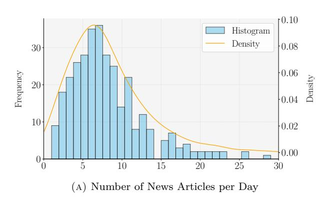

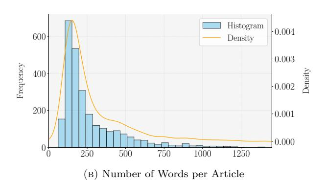

Note: Panel (a) displays the distribution of the number of news articles published per day, with most days having between 5 and 10 articles. Panel (b) shows the distribution of the number of words per article, where the majority are between 70 and 280 words, suggesting concise reporting. However, the long right tail indicates instances of more comprehensive coverage.

<span id="page-16-0"></span>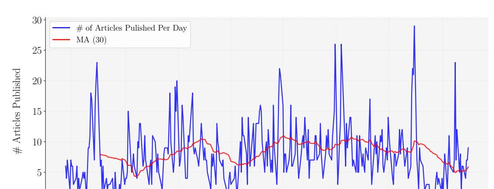

Figure 3: Time Series of Number of Articles per Day and 30-Period Moving Average

*Note: The time series shows the daily number of news articles published, characterized by significant variability with occasional sharp spikes. The 30-day moving average smooths these fluctuations, revealing an average publication rate of 5 to 10 articles per day.*

Mar May Jul Sep

2021

Sep Nov Jan

Jul 2020

0

#### Case 1: Treatment date is the same as the publication date; $\tilde{d}_0^i = d_0^i$

<span id="page-17-0"></span>Case 1a: News article published in a trading date and before the market opens;  $\tilde{d}_0^i \in \tilde{\mathfrak{d}} \wedge t_0^i < 09:30$ 

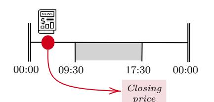

**Case 1b**: News article published in a trading date and during market hours;  $\tilde{d}^i_0 \in \tilde{\mathfrak{d}} \ \land \ t^i_0 \in [09:30,17:30]$ 

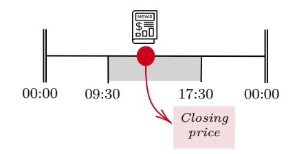

Case 2: Treatment date is the next closest trading day to publication;  $\tilde{d}_0^i = \Lambda(d_0^i)$ 

Case 2a: News article published in a trading day but after the market is closed for that day;  $d_i^0 \in \tilde{\mathfrak{d}} \ \wedge \ t_i^0 > 17:30$ 

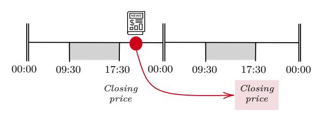

Case 2b: News article published in a non-trading day;  $d_0^i \notin \tilde{\mathfrak{d}}$ 

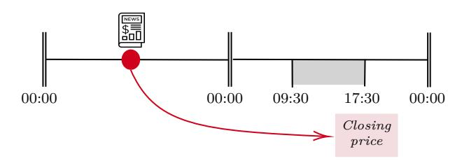

Note: This figure illustrates how we determine the effective treatment date for news articles based on their publication timing relative to market hours. The Spanish stock market operates from 09:30 to 17:30 on trading days. News published during a trading day during or before trading hours affects stock prices on the same day (Cases 1a and 1b), while news published after market close or on non-trading days affects prices on the next available trading day (Cases 2a and 2b). This temporal mapping ensures we correctly align news publication with the first opportunity for market reaction.

Figure 5: Average Silhouette Scores in the Training data

<span id="page-18-0"></span>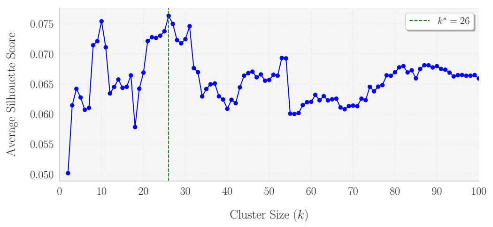

*Note: The plot presents the average silhouette scores calculated on the training data* D*tr for various cluster sizes k ranging from 2 to 100. The silhouette score measures how well data points fit within their assigned cluster by comparing intra-cluster cohesion with inter-cluster separation. A higher silhouette score (closer to +1) indicates better-defined clusters. The optimal number of clusters, k* <sup>∗</sup> = 26*, which maximizes the average silhouette score, is marked by a vertical dashed green line.*

Figure 6: Distribution of articles through KMeans clusters

<span id="page-19-0"></span>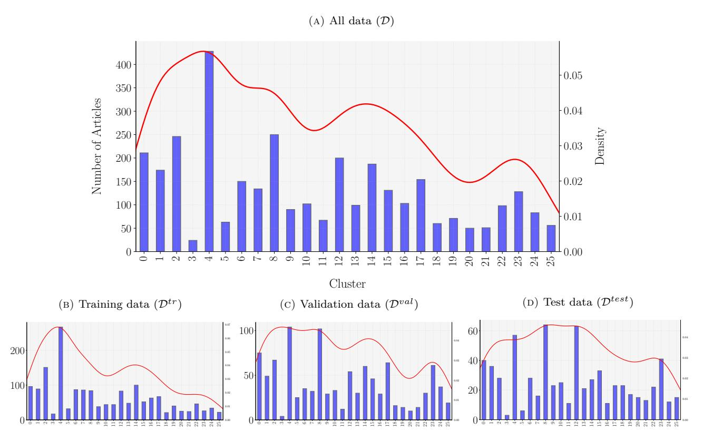

Note: This figure presents the distribution of articles across the  $k^*=26$  clusters, where the centroids were determined by applying the KMeans algorithm to the article embeddings from the training data. Panel (A) shows the distribution for the entire dataset (D), while Panels (B), (C), and (D) illustrate the distributions for the training ( $\mathcal{D}^{tr}$ ), validation ( $\mathcal{D}^{val}$ ), and test ( $\mathcal{D}^{test}$ ) datasets, respectively. The differences in distribution across splits suggest some temporal instability in the clustering results.

Figure 7: Distribution of articles through LLM clusters

<span id="page-20-0"></span>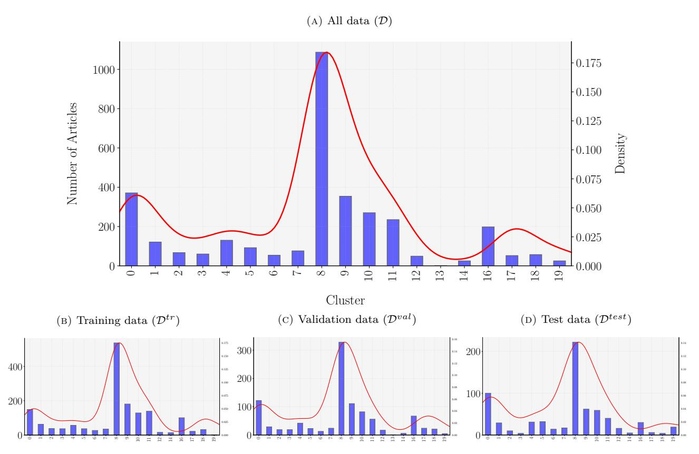

Note: This figure presents the distribution of news articles across clusters derived using an LLM-based approach. The upper plot shows the distribution for the entire dataset  $(\mathcal{D})$ , while the lower plots display the distributions for the training  $(\mathcal{D}^{tr})$ , validation  $(\mathcal{D}^{val})$ , and test  $(\mathcal{D}^{test})$  datasets. Clusters 8, 9, 10, and 11, which capture financial events or shocks, dominate the distribution, with cluster 8 (financial, minor, positive) representing approximately one-third of the dataset. This cluster includes articles related to financial reports with mildly positive outcomes, potentially offering insight for long trading signals. Unlike KMeans clustering with embeddings, this LLM-based clustering shows stable distributions across data splits, highlighting the robustness of this method over time.

Figure 8: Comparison of Cumulative Gross Returns across Clustering Approaches

#### (a) Panel A: Cumulative Gross Returns of PKMeans

<span id="page-21-0"></span>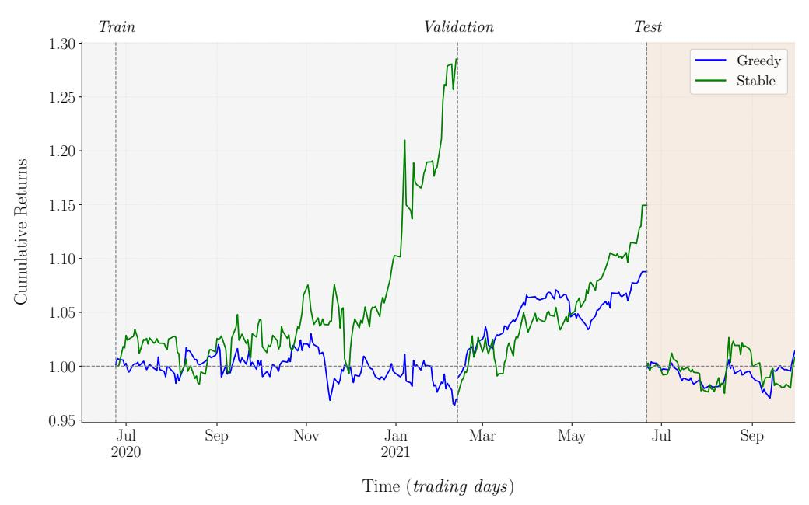

#### (b) Panel B: Cumulative Gross Returns of PLLM

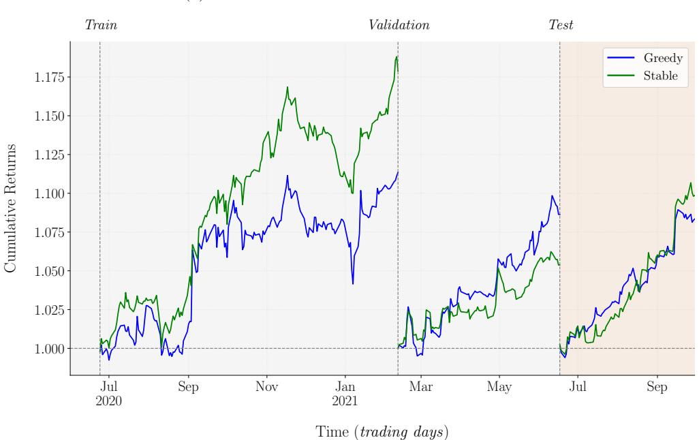

*Note:* Cumulative gross returns for KMeans (Panel A) and LLM (Panel B) clustering strategies. Holding period: *L* = 4 days. Traded clusters: *θ* = 13 for KMeans (*k* <sup>∗</sup> = 26) and *θ* = 10 for LLM (*k* = 20), optimized on train/validation Sharpe ratios. Test split highlighted in yellow.

FIGURE 9: Sensitivity of  $SR^{\mathcal{P}^{test}}$  to the holding window length (L)

<span id="page-22-0"></span>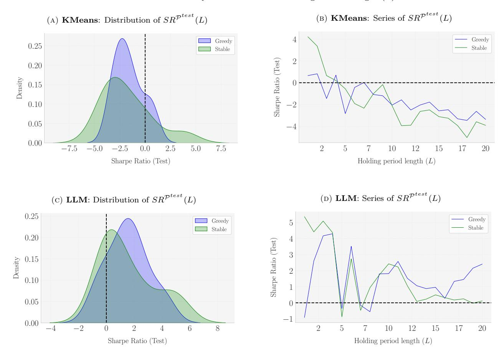

Note: Sensitivity of test portfolio Sharpe ratios to holding period L with  $\theta$  fixed at  $\lfloor 0.5k \rfloor$ . Left panels show distributions, right panels show series. KMeans produces left-skewed distributions with positive Sharpe ratios only for very short periods. LLM yields right-skewed distributions with more consistent positive performance across L values.

FIGURE 10: Sensitivity of  $SR^{\mathcal{P}^{test}}$  to the upper bound on the number of traded clusters on each side  $(\theta)$ 

<span id="page-23-0"></span>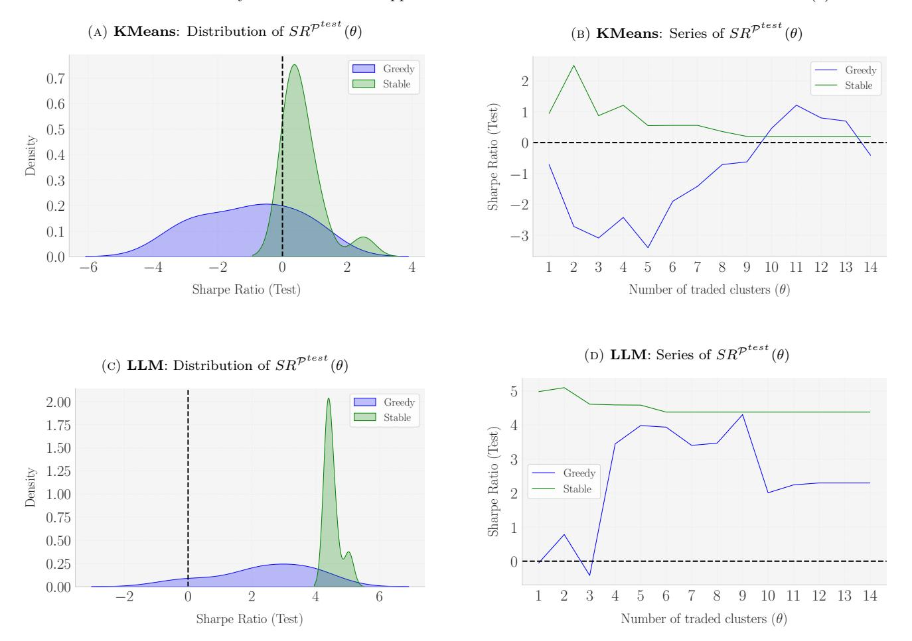

Note: Sensitivity of test portfolio Sharpe ratios to cluster bound  $\theta$  with L=4 fixed. KMeans shows mixed results: Stable algorithm works for low  $\theta$ , Greedy for high  $\theta$ , indicating instability. LLM demonstrates consistent positive Sharpe ratios across broader  $\theta$  ranges, suggesting superior robustness.

# **Appendix A. Appendix**

*Appendix A.1. KMeans Algorithm*

```
Algorithm 1. KMeans Clustering Algorithm
```

```
1: Input: Embedding vectors {e
                                  1
                                   , e
                                     2
                                      , . . . , e
                                            N }, number of clusters k
2: Output: Cluster assignments {D1, D2, . . . , Dk}, centroids {c1, c2, . . . , ck}
3: Initialize centroids {c1, c2, . . . , ck} randomly
4: repeat
5: Assignment Step:
6: for each vector e
                        i do
7: Assign e
                   i
                    to the nearest centroid:
                                             g = arg min
                                                     ℓ∈{1,...,k}
                                                              ∥e
                                                                 i − cℓ∥
                                                                       2
                                                                       2
8: Update cluster assignments: Dg ← Dg ∪ {i}
9: end for
10: Update Step:
11: for each cluster Dg do
12: Recalculate centroid cg:
                                                  cg =
                                                         1
                                                        |Dg|
                                                             X
                                                             i∈Dg
                                                                 e
                                                                   i
13: end for
14: until cluster assignments no longer change
15: Return cluster assignments {D1, D2, . . . , Dk} and centroids {c1, c2, . . . , ck}
```

#### *Appendix A.2. Hyperparameter Choice Justification*

Our hyperparameters are *L* and *θ*. Recall that *L* denotes the number of trading days over which we hold the positions in the beta-neutral strategy, while *θ* represents the upper bound on each side (long and short) for the amount of clusters we select for the trading strategy. The specific choice of hyperparameters we made for the results presented in the paper were:

$$L = 4$$
$$\theta = |0.5k|$$

where *k* represents the number of clusters (26 for KMeans clustering, and 20 for LLM clustering). This choice is not arbitrary nor opportunistic. Instead, it results from the maximization of the Sharpe Ratio of the portfolio in the train and validation samples for both KMeans and LLM clustering. This choice procedure is completely based on *in-sample* criteria and it prevents lookahead bias. The justification for such choices is made below.

#### *Appendix A.2.1. KMeans Clustering*

In Figure [A.1](#page-41-0) we can see that a choice of *L* = 4 in the training and validation splits generates the most stable Sharpe Ratio. Namely, In the train set (Figure [A.1a\)](#page-41-0), it makes more sense to choose low values of *L* (less than 4) to maximize the *SR*. However, in the validation set (Figure [A.1b\)](#page-41-0), it makes more sense to choose higher values of *L*. The choice of *L* = 4 represents a balanced compromise, providing a stable Sharpe Ratio profile across both splits, ensuring consistent in-sample performance.

[Insert Figure [A.1](#page-41-0) about here]

On the other hand, the choice of *θ* = ⌊0*.*5 · 26⌋ = 13 is a choice that pursues stability in the Sharpe Ratio of the train and validation portfolios. As we can see from Figure [A.2,](#page-42-0) the Sharpe Ratios tend to converge to the highest and most stable value when we choose the highest possible value of *θ*.

[Insert Figure [A.2](#page-42-0) about here]

#### *Appendix A.2.2. LLM Clustering*

Following a similar logic as below, the choice of *L* = 4 sets a consensus between the maximization of *SR*<sup>P</sup> *tr* and *SR*<sup>P</sup> *val* . That is, maximizing *SR*<sup>P</sup> *tr* requires lower holding period lengths (the maximizer is *L* = 4), while maximizing *SR*<sup>P</sup> *val* requires increasing the window length. Among this contradiction, from Figure [A.3](#page-43-0) it follows that *L* = 4 stands as a perfect choice to balance the maximization requirements in both samples, generating a stable choice for the holding period window length.

[Insert Figure [A.3](#page-43-0) about here]

Finally, the same conclusion as in KMeans applies here. By selecting *θ* = ⌊0*.*5 · 20⌋ = 10, we get a stable Sharpe Ratio. Even though we observe that *SR*<sup>P</sup> *tr* (*L*) falls momentarily at *θ* = 10 for the Greedy algorithm, it still constitutes a good choice. Conversely, at *θ* = 10 the greedy algorithm sees a jump in *SR*<sup>P</sup> *val* (*L*) (see Figure [A.4\)](#page-44-0). All in all, we can easily conclude that *θ* = ⌊0*.*5*k*⌋ arises as a good hyperpamrameter choice also for LLM clustering.

[Insert Figure [A.4](#page-44-0) about here]

#### *Appendix A.3. Cluster-Average Sharpe Ratios*

The distribution of cluster-average Sharpe Ratios across different clusters reveals distinct patterns between KMeans and LLM-based clustering approaches, as illustrated in Figure [A.5](#page-45-0)

Panel A presents the results for KMeans clustering, where we observe remarkably consistent distributional patterns across all three data splits. The distributions are approximately symmetric around zero, with the majority of Sharpe ratios falling within the [−5*,* 5] range. The training set exhibits the highest density peak (approximately 0*.*17), followed closely by the test set, while the validation set shows a slightly lower peak density of about 0*.*125. Notable in the validation set are small secondary peaks at the tails (around ±15), suggesting the presence of a few clusters with extreme performance characteristics. This consistency across splits suggests that the KMeans clustering approach produces stable performance groupings.

Panel B displays the results for LLM-based clustering, revealing more heterogeneous distributions across the splits. The validation set demonstrates a pronounced peak near zero with a maximum density of 0*.*2, indicating strong concentration of performance in this region. In contrast, the training set exhibits a markedly different pattern, with a flatter, more dispersed distribution extending from −20 to +20, suggesting greater performance variability across clusters. The test set presents an intermediate case, with moderate concentration around zero but maintaining significant mass in the positive region. This heterogeneity across splits might indicate that the LLM-based clustering captures more nuanced and potentially time-varying patterns in the underlying data.

The contrasting patterns between the two clustering approaches suggest different strengths: KMeans provides more stable and consistent performance groupings, while LLM-based clustering potentially captures more complex relationships, albeit with greater variability across different data splits.


[Table 8](tables/table_8.md)


#### Algorithm 2. Greedy Selection Top average Sharpe Ratio in Validation Set

- 1: Input: Set of clusters  $\mathcal{G} = \{1, 2, \dots, k^*\}$ , Sharpe Ratios in the validation sample  $\{SR_L^{(i,j)}\}_{(i,j)\in\mathcal{B}^{val}}$ , maximum number of traded clusters  $\theta \in \mathbb{N}$  (usually,  $\theta \propto k^*$ )
- 2: Output: Set of long-traded clusters  $\mathcal{G}_{\theta}^+$  and set of short-traded clusters  $\mathcal{G}_{\theta}^-$

### Step #1: Compute Cluster Average Sharpe Ratios in Validation Set

- 3: for each  $g \in \mathcal{G}$  do
- Compute average Sharpe Ratio  $\overline{SR}_g^{val} \leftarrow \frac{1}{|\mathcal{B}_g^{val}|} \sum_{(i,j) \in \mathcal{B}_g^{val}} SR_L^{(i,j)}$
- 5: end for

#### Step #2: Identify Positive and Negative Sharpe Ratio Clusters

- 6: Define  $\mathcal{G}_{SR^{+}}^{val} \leftarrow \{g \in \mathcal{G} \mid \overline{SR}_{g}^{val} > 0\}$ 7: Define  $\mathcal{G}_{SR^{-}}^{val} \leftarrow \{g \in \mathcal{G} \mid \overline{SR}_{g}^{val} < 0\}$

#### Step #3: Rank Clusters by Average Sharpe Ratio in the Validation Set

- 8: for each  $g \in \mathcal{G}$  do
- Rank the average Sharpe Ratio  $\mathfrak{R}_g^{val} \leftarrow \sum_{h \in \mathcal{G}} \mathbf{1} \left( \overline{SR}_h^{val} \geq \overline{SR}_g^{val} \right)$
- 10: end for

- $\begin{array}{l} \underline{Step \ \#4: \ Select \ Top \ \theta \ Clusters} \\ \text{11:} \ \overline{Define} \ \theta^+ \leftarrow \min(\theta, |\mathcal{G}^{val}_{SR^+}|) \ ; \quad \mathcal{G}^+_{\theta} \leftarrow \{g \in \mathcal{G} \mid 1 \leq \Re^{val}_g \leq \theta^+ \} \\ \text{12:} \ Define} \ \theta^- \leftarrow \min(\theta, |\mathcal{G}^{val}_{SR^-}|) \ ; \quad \mathcal{G}^-_{\theta} \leftarrow \{g \in \mathcal{G} \mid k^* \theta^- < \Re^{val}_g \leq k^* \} \end{array}$
- 13: Return Long-traded clusters  $\mathcal{G}_{\theta}^+$ , Short-traded clusters  $\mathcal{G}_{\theta}^-$

#### Algorithm 3. Rank Stability | Minimal Rank Difference between Train & Validation Sets

- 1: **Input:** Set of clusters  $\mathcal{G} = \{1, 2, ..., k^*\}$ , Sharpe Ratios in the training and validation sample  $\{SR_L^{(i,j)}\}_{(i,j)\in\mathcal{B}^{tr}}$  and  $\{SR_L^{(i,j)}\}_{(i,j)\in\mathcal{B}^{val}}$ , maximum number of traded clusters  $\theta$
- 2: Output: Set of long-traded clusters  $\mathcal{G}_{\theta}^+$  and set of short-traded clusters  $\mathcal{G}_{\theta}^-$

Step #1: Compute Cluster Average Sharpe Ratios in Training & Validation Set

- 3: for each  $g \in \mathcal{G}$  do
- 4: Compute average Sharpe Ratio in  $\mathcal{B}^{tr}$ :  $\overline{SR}_g^{tr} \leftarrow \frac{1}{|\mathcal{B}_q^{tr}|} \sum_{(i,j) \in \mathcal{B}_q^{tr}} SR_L^{(i,j)}$
- 5: Compute average Sharpe Ratio in  $\mathcal{B}^{val}$ :  $\overline{SR}_g^{val} \leftarrow \frac{1}{|\mathcal{B}_g^{val}|} \sum_{(i,j) \in \mathcal{B}_a^{val}} SR_L^{(i,j)}$
- 6: end for

#### Step #2: Rank Clusters

- 7:  $\overline{\mathbf{for} \ \mathrm{each} \ g \in \mathcal{G} \ \mathbf{do}}$
- 8: Rank the average Sharpe Ratios in  $\mathcal{B}^{tr}$ :  $\mathfrak{R}_g^{tr} \leftarrow \sum_{h \in \mathcal{G}} \mathbf{1} \left( \overline{SR}_h^{tr} \geq \overline{SR}_g^{tr} \right)$
- 9: Rank the average Sharpe Ratios in  $\mathcal{B}^{val}$ :  $\mathfrak{R}_g^{val} \leftarrow \sum_{h \in \mathcal{G}} \mathbf{1} \left( \overline{SR}_h^{val} \ge \overline{SR}_g^{val} \right)$
- 10: end for

#### Step #3: Calculate Rank Differences

- 11: for each  $g \in \mathcal{G}$  do
- 12: Calculate rank difference  $\delta_g \leftarrow |\Re_q^{tr} \Re_q^{val}|$
- 13: end for

#### Step #4: Select Top $\theta$ Clusters with Smallest Rank Differences

- 14: **for** each  $g \in \mathcal{G}$  **do**
- 15: Rank the rank difference:  $\Re(\delta_q) \leftarrow \sum_{h \in G} \mathbf{1} (\delta_q \geq \delta_h)$
- 16: end for
- 17: Select top  $2\theta$  clusters with smallest  $\delta_g$ :  $\mathcal{G}_{\theta} = \{g \in \mathcal{G} \mid 1 \leq \Re(\delta_g) \leq 2\theta\}$

#### # Step 5: Determine Long and Short Positions

- 18: Define  $\mathcal{G}_{\theta}^{+} = \{ g \in \mathcal{G}_{\theta} \mid \overline{SR}_{g}^{tr} > 0 \text{ and } \overline{SR}_{g}^{val} > 0 \}$
- 19: Define  $\mathcal{G}_{\theta}^{-} = \{g \in \mathcal{G}_{\theta} \mid \overline{SR}_{g}^{r} < 0 \text{ and } \overline{SR}_{g}^{val} < 0\}$
- 20: **Return** Long-traded clusters  $\mathcal{G}_{\theta}^+$ , Short-traded clusters  $\mathcal{G}_{\theta}^-$

Appendix A.5. Sample of articles for each cluster

Table A1: KMeans clustering. Proposed name for the clusters and sample of 3 articles for each cluster.


[Table 9](tables/table_9.md)


[Table 10](tables/table_10.md)


<span id="page-31-0"></span>


[Table 11](tables/table_11.md)


[Table 12](tables/table_12.md)


## **Algorithm 4.** Function Calling Workflow for Llama-3 **Require:** D: Dataset of news articles **Ensure:** Structured JSON output for each article 1: Initialize Llama-3 model via GroqCloud API 2: **for** each article *i* ∈ D **do** *▷* Iterate over each article in the dataset 3: **Message: System** *▷* Define the role and task for the LLM "*You are a function calling LLM that analyzes business news in Spanish. For every article, identify the firms that are directly affected by the news and classify the shocks in type, magnitude and direction*" 4: **Message: User** *▷* User provides the article text as input Content: prompt *P<sup>i</sup>* containing the text of article *i* 5: **Tool: news\_parser** *▷* Define the news\_parser function Parameters: {firms: array of objects}, where each object contains: • firm: string ("*each one firm in firms* ") • ticker: string ("*stock market ticker*") • shock\_type: enum {demand, supply, financial, policy, technology} • shock\_magnitude: enum {minor, major} • shock\_direction: enum {positive, negative} 6: Send initial messages and tools to Llama-3 *▷* Initiate interaction with the LLM 7: Retrieve response from Llama-3 *▷* Get the initial response from the LLM 8: **if** Function call is requested by Llama-3 **then** *▷* Check if the LLM needs to call a function 9: Execute news\_parser function with provided arguments *▷* Run the function 10: Append function response to the conversation *▷* Include function output in the dialogue 11: Send updated messages to Llama-3 *▷* Continue the conversation with new information 12: Retrieve final response from Llama-3 *▷* Get the final output from the LLM 13: **end if** 14: Extract and store structured JSON output *▷* Save the processed data 15: **end for**

*Appendix A.7. Why not using a different benchmark?*

In evaluating our novel Large Language Model (LLM) methodology for classifying news-implied firm-specific shocks, it is imperative to establish a robust and relevant benchmark. Our chosen benchmark involves transforming news articles into high-dimensional vector embeddings followed by clustering these embeddings using the KMeans algorithm. This section delineates the rationale behind selecting KMeans clustering of vector embeddings over other potential benchmarks such as sentiment analysis and topic modeling.

#### *Why not Sentiment Analysis as a benchmark?*

Sentiment analysis is a widely recognized technique in natural language processing that aims to determine the emotional tone conveyed in a text, typically categorizing content as positive, negative, or neutral. While sentiment analysis provides a straightforward approach to gauging the general tone of news articles, it falls short in several critical aspects when juxtaposed with our objectives.

First, sentiment analysis is not sufficiently granular. Our LLM methodology classifies news articles into 20 distinct categories of economic shocks while sentiment analysis classifies articles in a coarse manner, typically into positive, negative, or neutral categories, which is inadequate for benchmarking a detailed classification model.

Second, sentiment analysis predominantly focuses on the linguistic and emotional aspects of the text, which do not necessarily correlate with the economic impact on firms. For instance, a neutral-toned article could describe a significant economic event, while a positive sentiment might not always translate to favorable economic outcomes. Consequently, the sentiment does not provide direct insights into the economic consequences, making it an economically irrelevant benchmark for our purposes.

Third, sentiment analysis algorithms are often sensitive to linguistic subtleties, leading to inconsistent results across different languages and contexts. For example, sarcasm or idiomatic expressions can distort sentiment scores, undermining the reliability of sentiment analysis as a benchmark. This variability poses a challenge for standardization, especially in a multilingual context. For instance, the sentiment derived from analyzing the text in English may significantly differ from the sentiment in Spanish.

Fourth, sentiment analysis is not robust in the sense that different sentiment analysis tools yield divergent assessments of the same text. As shown below, we observe considerable differences in the identified sentiment when applying multiple sentiment analysis providers to a specific article. This lack of consistency undermines the reliability of sentiment analysis as a benchmark, making it unsuitable for our purposes.

*Sentiment analysis is highly sensitive to the specific tool or model employed. Here, we demonstrate this by analyzing a piece of business news using various popular sentiment analysis tools: TextBlob, text2data, VADER, and FinBERT. The methods vary significantly in both their approach to sentiment determination and the output they provide, as illustrated below.*[1](#page-34-0)

Example 3: A news article about TelefÃşnica and Cellnex | Sentiment: TextBlob

**Cellnex will face more competition in Europe Score: 0.50** *TelefÃşnica's (TEF.MC) subsidiary, Telxius Telecom, has agreed to sell its telecommunications tower division in Europe and Latin America to American Tower (AMT), which will expand the latter's presence in Europe and increase competition for the Spanish wireless telecommunications group Cellnex Telecom (CLNX.MC), according to Equita Sim.* **Score: 0.00** *The transaction "represents the entry of a new independent tower operator into the Spanish market and potentially more competition for future growth in the European market as well," says the brokerage firm.* **Score: 0.06**

Overall **Score: 0.085**

*Note: TextBlob is a general-purpose sentiment analysis tool that relies on a pre-built lexicon to assess the polarity of the text. It computes a sentiment score ranging from -1 to 1, where -1 signifies a negative sentiment, 1 indicates a positive sentiment, and 0 represents a neutral sentiment. The methodology behind TextBlob focuses on tokenizing the input into words and phrases, which are compared against its built-in polarity dictionary.*

Example 4: A news article about TelefÃşnica and Cellnex | Sentiment: text2data

<span id="page-34-0"></span><sup>1</sup>Note that applying Loughran-Macdonald is not recommended in for short texts as it yields sparse results. For example, in the example we are considering, it outputs a category distribution that only loads on "*Strong Modal*", which is not a really useful analysis. LM\_Scores = {'Negative': 0, 'Positive': 0, 'Uncertainty': 0, 'Litigious': 0, 'Strong\_Modal': 2, 'Weak\_Modal': 0, 'Constraining': 0, 'Complexity': 0}

## **Cellnex will face more competition in Europe Score: 0.145**

*TelefÃşnica's (TEF.MC) subsidiary, Telxius Telecom, has agreed to sell its telecommunications tower division in Europe and Latin America to American Tower (AMT), which will expand the latter's presence in Europe and increase competition for the Spanish wireless telecommunications group Cellnex Telecom (CLNX.MC), according to Equita Sim.* **Score: -0.512** *The transaction "represents the entry of a new independent tower operator into the Spanish market and potentially more competition for future growth in the European market as well," says the brokerage firm.* **Score: -0.560**

Overall **Score: -0.61**

*Note: text2data employs scientific deep learning NLP methods to analyze sentiment. Every sentence is split into smaller chunks and represented as a tree structure, capturing the syntactic relationships between words and phrases. To determine the final sentiment score, text2data uses probabilistic methods based on a pre-trained data model, providing an output score between -1 and 1, where -1 is negative and 1 is positive.*

Example 5: A news article about TelefÃşnica and Cellnex | Sentiment: VADER

## **Cellnex will face more competition in Europe Score: 0.00**

*TelefÃşnica's (TEF.MC) subsidiary, Telxius Telecom, has agreed to sell its telecommunications tower division in Europe and Latin America to American Tower (AMT), which will expand the latter's presence in Europe and increase competition for the Spanish wireless telecommunications group Cellnex Telecom (CLNX.MC), according to Equita Sim.* **Score: 0.69** *The transaction "represents the entry of a new independent tower operator into the Spanish market and potentially more competition for future growth in the European market as well," says the brokerage firm.* **Score: 0.57**

Overall **Score: 0.81**

*Note: VADER (Valence Aware Dictionary and sEntiment Reasoner) is a lexicon and rule-based sentiment analysis tool uses a combination of lexical features (i.e., words) that are generally classified as having positive, negative, or neutral valence. VADER produces four sentiment metrics: positive, negative, neutral, and a compound score. The compound score is a normalized, weighted composite score that ranges from -1 to 1, indicating the overall sentiment of the text. In this example, we provide the compound measure sentence by sentence and for the whole text.*

## **Cellnex will face more competition in Europe Negative, 0.75**

*TelefÃşnica's (TEF.MC) subsidiary, Telxius Telecom, has agreed to sell its telecommunications tower division in Europe and Latin America to American Tower (AMT), which will expand the latter's presence in Europe and increase competition for the Spanish wireless telecommunications group Cellnex Telecom (CLNX.MC), according to Equita Sim.* **Neutral, 0.98** *The transaction "represents the entry of a new independent tower operator into the Spanish market and potentially more competition for future growth in the European market as well," says the brokerage firm.* **Negative, 0.81**

Overall **Negative, 0.94**

*Note: FinBERT is a domain-specific transformer-based model trained on financial texts. Unlike the previous models, FinBERT provides both a sentiment classification (Positive, Negative, Neutral) and a confidence score ranging from 0 to 1, representing the model's certainty about the sentiment classification.*

*Why not Topic Modeling as a benchmark?*

Topic modeling, particularly techniques like Latent Dirichlet Allocation (LDA), decomposes text into a set of latent topics based on word co-occurrences. Topic modelling offer a more granular approach compared to sentiment analysis and could potentially offer a valid benchmark for our purpose. However, we argue that transforming news articles into vector embeddings and subsequently clustering them using KMeans offers a more balanced approach than topic modeling.

Topic models rely on bag-of-words representations, which disregard the order and context of words. This limitation hampers the model's ability to capture complex semantic relationships and contextual nuances essential for accurately identifying economic shocks. Consequently, topic models may overlook subtle but economically significant information present in the text. On the other hand, vector embeddings encapsulate rich semantic information by capturing the relationships between words in a continuous vector space. Unlike topic models, which are confined to word co-occurrences, embedding models, particularly transformer-based, generate context-dependent representations, allowing for a nuanced understanding of polysemy and context. This means that the same word can have different embeddings depending on the context of the sentence, such as "*Apple*" in "*Apple is a leading tech company*" versus "*Apple is a type of fruit*".

An important advantage of vector embeddings is that they scale efficiently with large corpora and can be generated at various granularities, including word, sentence, or document levels. This scalability makes embeddings highly adaptable for diverse downstream tasks such as clustering, classification, and similarity detection. In contrast, topic models often require extensive manual tuning and become computationally expensive with larger datasets, limiting their practicality for extensive analyses. This makes embeddings a superior choice for grouping news articles and analyzing their economic implications, as compared to the relatively rigid and broad classifications produced by topic models.

It is true, however, that topic models excel at grouping articles based on shared themes, offering a straightforward way to identify and interpret these themes by examining the common content of the grouped articles. This interpretability is a key advantage of topic models, as it allows for clear labeling of themes. In contrast, vector embeddings lack inherent interpretability at the dimension level. The individual dimensions of an embedding do not have an intuitive meaning, making it challenging to directly understand the relationships they capture. However, this limitation can be mitigated by clustering the embeddings to then apply a similar interpretive process as with topic models: analyzing the articles within each cluster to infer the common patterns. As demonstrated in our analysis, these clusters often correspond to firm-specific or industry-specific topics, offering valuable insights into economic relationships and forming a valuable benchmark for our LLM's classification of firm-specific shocks.

Lastly, using embeddings as a benchmark is particularly compelling because they represent the foundational layer of an LLM. The first step an LLM's processing pipeline is to transform the text that it is fed into high-dimensional embeddings for further processing. By benchmarking against embeddings, we ensure a direct and relevant comparison between the foundational representations used by LLMs and our specialized classification methodology. This comparison highlights the added value of the LLM's capacity to convert these semantic representations (i.e: the vector embeddings) into economically meaningful classifications. (i.e: our news-implied firm-specific shock classifications).

In summary, KMeans clustering of vector embeddings offers a robust and economically relevant benchmark for our LLM-based methodology. It provides a rich semantic representation, context-dependent flexibility, and scalability that surpass sentiment analysis and topic modeling. Additionally, its alignment with the underlying architecture of LLMs ensures a meaningful comparison. As demonstrated in our analysis, the clusters derived through this approach are predominantly firm or industry-specific, thereby offering a suitable and superior benchmark against which to measure the effectiveness of our granular classification of news-implied firm-specific shocks.

#### <span id="page-37-0"></span>*Appendix A.8. Trading Intensity*

The extraordinary performance of our proposed LLM-based methodology warrants a careful examination of its implementation costs and practical viability. While our primary objective has been to develop a framework that better captures the economic content of news articles and their subsequent market impact, the practical implementation of such strategies necessarily involves trading frictions that could affect their real-world efficacy. In this section, we analyze the trading intensity patterns of both methodologies to provide a more complete assessment of their relative merits and to understand how transaction costs might influence their comparative advantages. We begin by examining the temporal evolution of open positions for both approaches, which provides insights into their underlying trading dynamics and stability characteristics. This analysis is followed by detailed trading intensity metrics and concludes with a reassessment of portfolio statistics after accounting for transaction costs.

#### [Insert Figure [A.6](#page-46-0) about here]

The temporal evolution of open positions, as illustrated in Figure [A.6,](#page-46-0) reveals fundamental differences in the stability and reliability of trading signals generated by KMeans versus LLM-based clustering approaches. The KMeans implementation exhibits pronounced volatility in position management, particularly evident in the Greedy algorithm's behavior, which shows extreme fluctuations ranging from 6 to 105 positions. This erratic pattern suggests that KMeans-detected clusters are highly sensitive to market noise and potentially capture transient correlations rather than fundamental relationships. The substantial divergence between Greedy and Stable algorithms under KMeans further underscores the method's instability, as even minor variations in cluster selection criteria lead to dramatically different trading decisions. In stark contrast, the LLM-based approach demonstrates remarkably more coherent and stable position management. Both Greedy and Stable algorithms maintain more closely aligned position counts, typically ranging between 20 and 75 positions, with highly correlated temporal movements. This convergence in behavior between algorithms suggests that LLM-identified clusters capture more fundamental and persistent market relationships. Particularly telling is the test period performance, where KMeans exhibits increased position volatility and extreme spikes, while the LLM approach maintains consistent position patterns across both algorithms. This stability in the out-of-sample period provides strong evidence that LLM-derived signals, grounded in economic analysis of firm-specific shocks, generalize more effectively to unseen data.

[Insert Table [A3](#page-39-0) about here]

The trading intensity metrics, detailed in Table [A3,](#page-39-0) provide quantitative validation of the structural differences between KMeans and LLM clustering approaches. Under KMeans, the dramatic disparity between Greedy and Stable algorithms (averaging 40.1 versus 10.77 positions, with standard deviations of 18.59 and 6.41 respectively) reflects the method's fundamental instability. More concerning is the Stable algorithm's exceptionally high Changes/Position ratio (3.228 versus 0.798 for Greedy), indicating frequent position adjustments necessitated by the transient nature of KMeans-identified clusters. The LLM implementation demonstrates substantially more balanced and stable metrics across both algorithms. Average position counts converge (31.8 for Greedy, 26.61 for Stable) with more moderate standard deviations (14.84 and 12.16), suggesting that both aggressive and conservative cluster selection approaches identify similar, fundamentally-driven trading opportunities. The more balanced Changes/Position ratios (1.234 and 1.473) and consistent turnover rates (approximately 39% for both algorithms) indicate that LLM-identified clusters require less frequent rebalancing, supporting the hypothesis that they capture more persistent market relationships.

[Insert Table [A4](#page-40-0) about here]

Finally, the introduction of trading costs impacts the performance metrics of both clustering approaches (see Table [A4\)](#page-40-0), though with notably different implications for their practical viability. The KMeans-based strategy exhibits visible performance degradation, particularly evident in the test period where both algorithms generate losses (Greedy: -4.1%, Stable: -6.8% average annual returns). This deterioration is accompanied by elevated risk metrics, with the Stable algorithm showing particularly concerning characteristics including high standard deviation (14.2%) and extreme kurtosis (14.74) in the test period, suggesting frequent occurrence of extreme returns. In contrast, the LLM-based approach demonstrates superior resilience to trading costs, maintaining more stable performance characteristics across all periods. Most notably, in the test period, the strategy maintains its positive performance (Greedy: 19.0%, Stable: 24.7% annual returns) with substantially lower risk metrics (standard deviations of 6.2% and 7.0% respectively). The LLM approach's more moderate VaR and CVaR measures compared to KMeans further underscore its superior risk management characteristics under transaction costs. This stark contrast in net performance can be attributed to the fundamentally different nature of the signals generated by each approach. While KMeans' statistically-driven clusters require frequent rebalancing that amplifies transaction costs, the LLM's economically-motivated clusters appear to identify more persistent price patterns that remain profitable even after accounting for trading frictions. However, it is worth noting that neither approach was explicitly optimized for transaction cost efficiency, suggesting potential for further improvement through cost-aware portfolio construction. These results highlight that while our LLM-based news parser successfully captures predictable market reactions to news articles, practitioners implementing such strategies would benefit from incorporating transaction costs into their optimization framework.

Table A3: Trading Intensity Analysis: Model Comparison

(A) Panel A: KMeans

<span id="page-39-0"></span>


[Table 13](tables/table_13.md)


(B) Panel B: LLM


[Table 14](tables/table_14.md)


Note: This table presents trading intensity metrics for both Greedy and Stable algorithms across different data splits for two different models: KMeans (Panel A) and LLM (Panel B). The metrics are computed at a daily frequency. The '# Open Positions' columns report position-related statistics: 'Avg.' shows the mean number of concurrent open positions per day, 'Std.' represents their standard deviation, while 'Max' and 'Min' indicate the maximum and minimum number of positions held simultaneously. Under 'Trading Activity (%)', 'Turnover' is calculated as the sum of absolute changes in position sizes divided by the total portfolio size, expressed as a percentage; formally, Turnover $_t = 100 \times (\sum_i |w_{i,t} - w_{i,t-1}|)/(\sum_i |w_{i,t}|)$ , where  $w_{i,t}$  represents the position size in asset i at time t. 'Changes/Pos.' represents the average number of modifications per position per day, computed as the daily turnover divided by the average number of positions, providing insight into how actively individual positions are managed. The 'Trading Costs (%)' section reports 'Cost' as the average daily implementation shortfall (computed as the product of daily turnover and a transaction cost parameter of 10 basis points) expressed in percentage terms, while 'Active' shows the percentage of trading days with at least one open position. All metrics are first computed daily and then averaged over their respective periods, except for Max and Min positions which represent the absolute extremes over each period.

Table A4: Portfolio Statistics Comparison: KMeans vs LLM Clustering (net of Trading Costs)

(a) Panel A: Statistics of PKMeans

<span id="page-40-0"></span>


[Table 15](tables/table_15.md)


(b) Panel B: Statistics of PLLM


[Table 16](tables/table_16.md)


*Note: Portfolio statistics of trading strategies based on clusters obtained from KMeans (Panel A) and LLM (Panel B) approaches. The statistics provided include performance metrics (Cumulative Return, Average Return (%)), risk measures (Standard Deviation (%), Maximum Drawdown (%), Value at Risk (%), Conditional Value at Risk (%)), risk-adjusted performance ratios (Sharpe Ratio, Sortino Ratio, Calmar Ratio), and return distribution characteristics (Skewness, Excess Kurtosis). These statistics are provided for both cluster-selection algorithms: Greedy and Stable. Except for the Cumulative Return, all returns are annualized. The Sharpe Ratio is computed using the daily returns, assuming 252 trading days in a year. The Sortino Ratio is calculated using the daily downside returns. The Maximum Drawdown is the maximum loss from a peak to a trough. The Calmar Ratio is the ratio of the annualized return to the maximum drawdown. Skewness measures the asymmetry of the return distribution, while Kurtosis quantifies the tails' thickness. The Value at Risk (VaR) and Conditional Value at Risk (CVaR) are calculated at a 95% confidence level. All returns are calculated net of transaction costs. We implement a transaction cost estimate of 10 basis points per trade,. The Greedy algorithm longs (shorts) clusters that maximize (minimize) the cluster-average-SR in the validation sample subject to a positivity (negativity) constraint, while the Stable algorithm longs (shorts) clusters that minimize the rank difference between the training and validation rankings of the cluster-average-SR's subject to a positivity (negativity) constraint, which is now imposed on both sample splits. In both algorithms, the cardinality of each leg is upper-bounded by a hyperparameter θ. The holding period of the beta-neutral positions is set to L = 4 trading days for both approaches. The number of traded clusters is θ* = 0*.*5*k* = 13 *for KMeans (k* <sup>∗</sup> = 26 *clusters) and θ* = 0*.*5*k* = 10 *for LLM (k* <sup>∗</sup> = 20 *clusters). The selection criteria for these hyperparameters (L, θ) is based on maximizing the Sharpe Ratios of the train and validation samples.*

FIGURE A.1: Sharpe Ratios in the train and validation splits as a function of L (KMeans)

<span id="page-41-0"></span>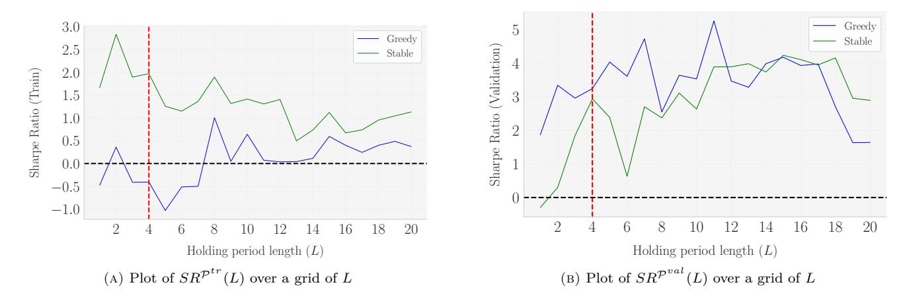

Note: This figure shows the Sharpe Ratios (SR) as a function of the holding period length (L) for the KMeans clustering method in the training (Panel a) and validation (Panel b) splits. In Panel (a), the Sharpe Ratios in the training set indicate that lower values of L (less than 4) maximize performance. Conversely, in Panel (b), the validation set shows higher Sharpe Ratios for longer holding periods. The choice of L=4 represents a balanced compromise, providing a stable Sharpe Ratio profile across both splits, ensuring consistent in-sample performance without introducing lookahead bias.

Figure A.2: Sharpe Ratios in the train and validation splits as a function of *θ* (KMeans)

<span id="page-42-0"></span>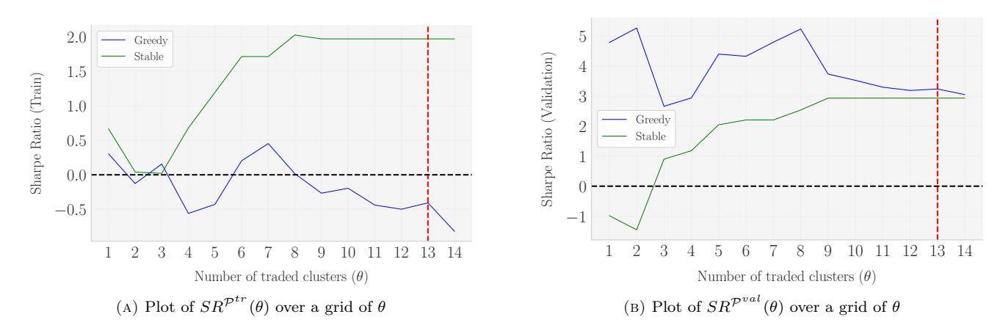

*Note: This figure illustrates the Sharpe Ratios (SR) as a function of θ, the upper bound on the number of traded clusters, for the KMeans clustering method in the training (Panel a) and validation (Panel b) splits. In Panel (a), the Sharpe Ratios in the training set show a trend of increasing stability and maximizing performance as θ approaches its upper limit. Similarly, Panel (b) displays a consistent pattern in the validation set, where higher values of θ lead to convergence at the highest and most stable Sharpe Ratios. The choice of θ* = 13 *(i.e:* ⌊0*.*5 · 26⌋*) reflects this observed stability and optimization, providing a balanced and robust selection for the portfolio strategy.*

FIGURE A.3: Sharpe Ratios in the train and validation splits as a function of hyperparameters (LLM)

<span id="page-43-0"></span>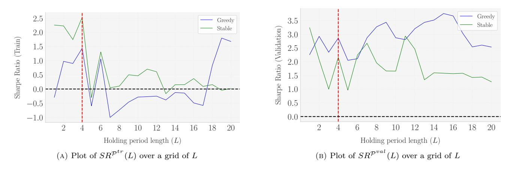

Note: This figure shows the Sharpe Ratios (SR) as a function of the holding period length (L) for the LLM clustering method, across the training (Panel a) and validation (Panel b) splits. In Panel (a), the Sharpe Ratios in the training set reach their maximum at L=4, suggesting shorter holding periods are more effective for maximizing performance. Conversely, Panel (b) illustrates that longer holding periods yield higher Sharpe Ratios in the validation set. The choice of L=4 serves as a compromise, balancing the trade-off between maximizing SR in both splits and providing a stable and consistent holding period length for the strategy.

FIGURE A.4: Sharpe Ratios in the train and validation splits as a function of  $\theta$  (LLM)

<span id="page-44-0"></span>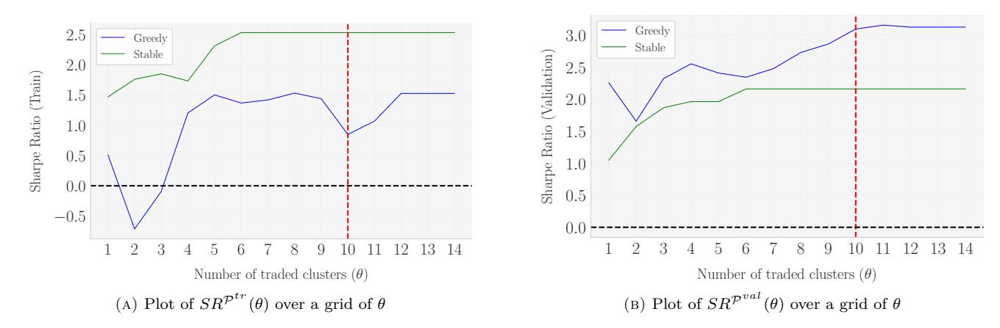

Note: This figure illustrates the Sharpe Ratios (SR) as a function of  $\theta$ , the upper bound on the number of traded clusters, for the LLM clustering method in the training (Panel a) and validation (Panel b) splits. In Panel (a), the Sharpe Ratios for the training set indicate a temporary dip at  $\theta=10$  for the Greedy algorithm, yet this value still provides a relatively stable outcome. In contrast, Panel (b) shows that  $\theta=10$  leads to a noticeable increase in Sharpe Ratios for the validation set, particularly benefiting the Greedy algorithm. The choice of  $\theta=\lfloor 0.5k \rfloor=10$  strikes a balance, confirming it as an effective hyperparameter selection for achieving stability in both the training and validation splits with LLM clustering.

FIGURE A.5: Distribution of Cluster-Average Sharpe Ratios  $(\overline{SR}_g)$  by Split

<span id="page-45-0"></span>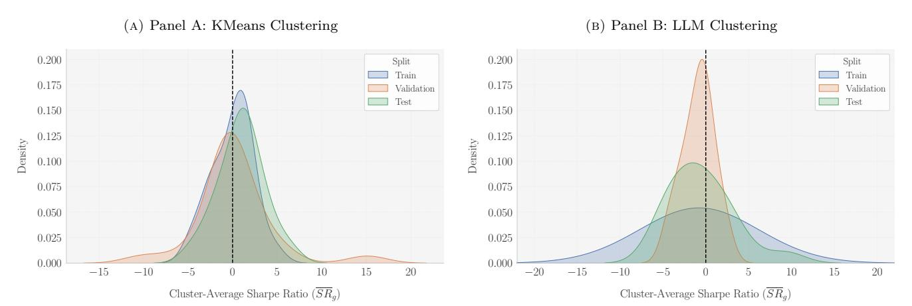

Note: This figure presents the distribution of cluster-average Sharpe Ratios  $(\overline{SR}_g)$  across training, validation, and test data splits for both KMeans clustering (Panel A) and LLM clustering (Panel B). Each Sharpe Ratio is computed as the average of beta-neutral positions associated with articles in a given cluster. The KMeans approach (Panel A) shows distributions centered around 0 in the validation set, with some outliers exhibiting unusually high or low Sharpe Ratios. The training and test set distributions are slightly right-skewed, suggesting better performance in certain clusters, with no significant outliers. In contrast, the LLM clustering (Panel B) exhibits left-skewed distributions across all splits, indicating a higher frequency of lower Sharpe Ratios. The training data shows fat tails, suggesting extreme values, while the validation data has lighter tails. The test data distribution is more bell-shaped, with Sharpe Ratios concentrated between 5 and 15, indicating stronger performance in some clusters.

Figure A.6: Evolution of Open Positions: KMeans vs LLM Clustering

#### (a) Panel A: KMeans Clustering

<span id="page-46-0"></span>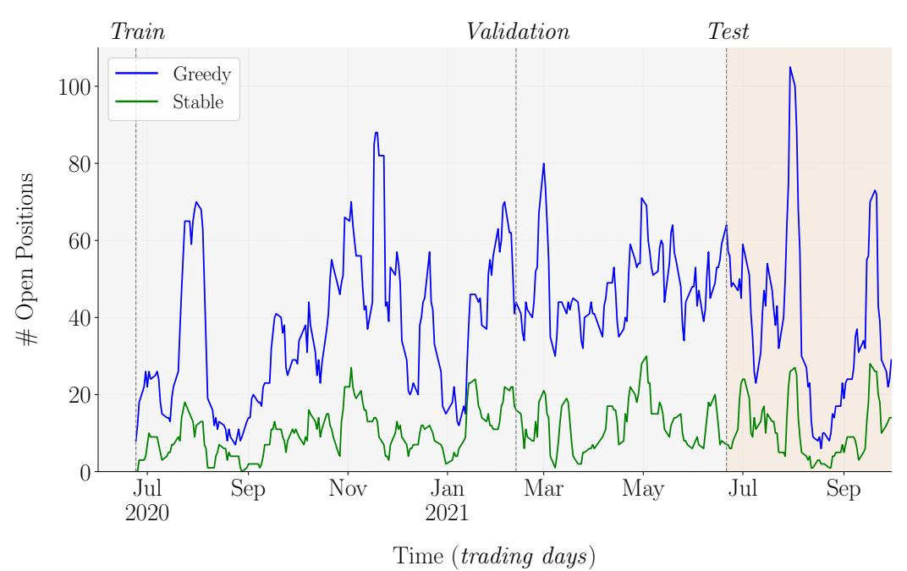

#### (b) Panel B: LLM Clustering

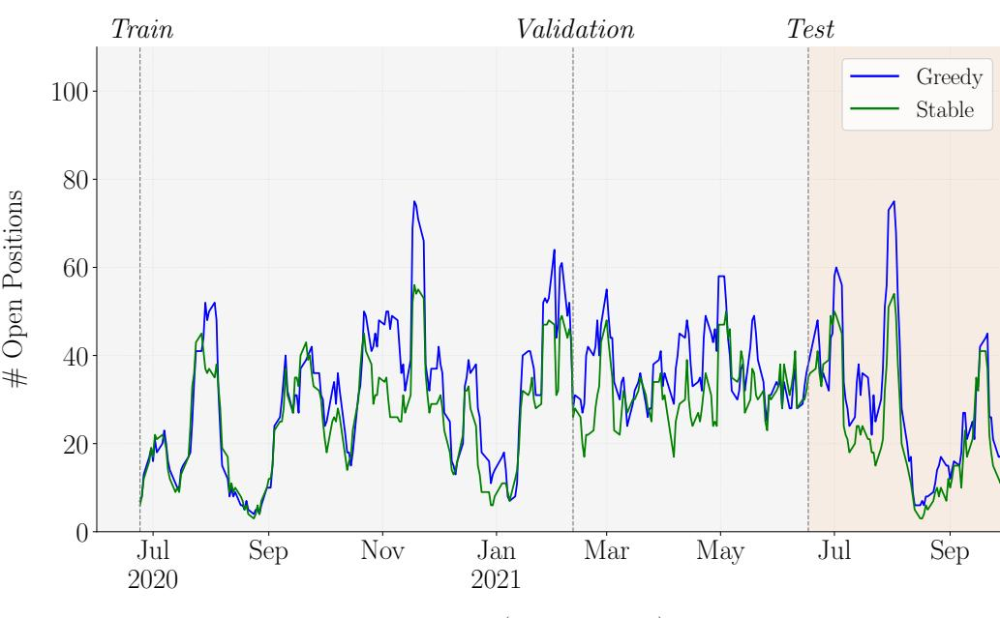

Time (trading days)

*Note: This figure shows the daily evolution of the number of open positions for both Greedy (blue) and Stable (green) algorithms across different data splits (Train, Validation, Test) using KMeans clustering (Panel A) and LLM clustering (Panel B). The time period spans from July 2020 to September 2021. Vertical dashed lines separate the different data splits. The Greedy algorithm selects clusters that maximize (minimize) the cluster-average-SR for long (short) positions, while the Stable algorithm minimizes the rank difference between training and validation rankings. The number of traded clusters is θ* = 0*.*5*k* = 13 *for KMeans (k* <sup>∗</sup> = 26 *clusters) and θ* = 0*.*5*k* = 10 *for LLM (k* <sup>∗</sup> = 20 *clusters).* 46